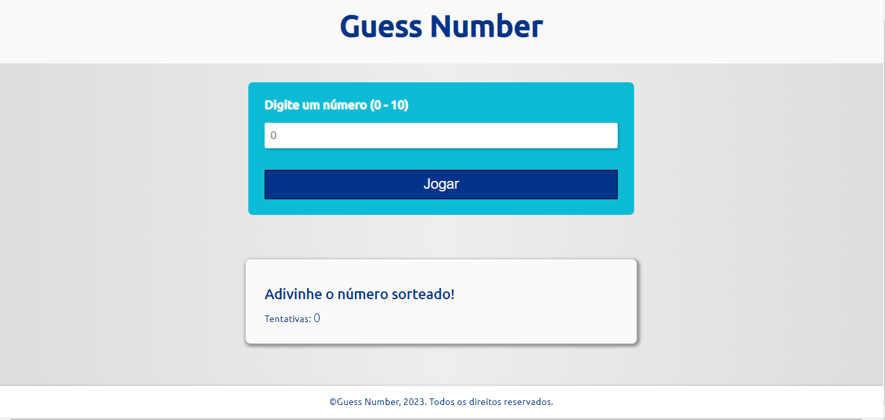

<h1 align="center"> Guess Number </h1>

Jogo criado durante o curso "HTML5, CSS3 e Javascript na prática" da Udemy. Foram utilizados fundamentos simples de HTML e CSS, focado em Javascript para a criação de um jogo de adivinhação em que um usuário tenta adivinhar o número aleatório de 0 até 10.

 
